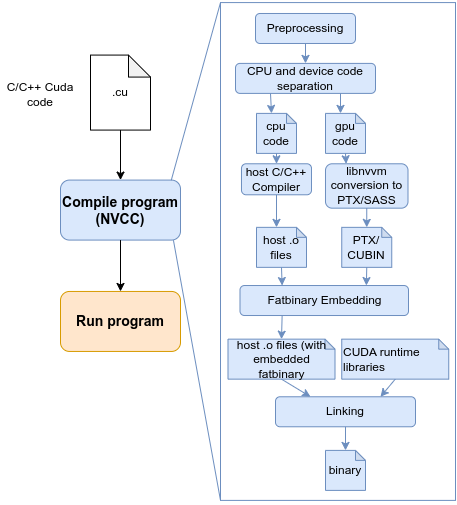

# CUDA-programming-examples-TUM-HPC
## Building CUDA program

To build cuda program run following command:
```bash
nvcc file1.cu,file2.cu,... -o result_binary
```

CUDA compilation supports a variety of options for performance tuning, device targeting, and feature enablement. Commonly used nvcc flags include:

```bash
-arch=sm_80: Compile for a specific GPU architecture (e.g., Ampere with Tensor Cores)

--ptxas-options=-v: View register usage and shared memory statistics

-lineinfo: Enables source-level profiling with tools like nvprof or Nsight

-rdc=true: Enable relocatable device code — required for dynamic parallelism

-arch=sm_80 -DUSE_TENSOR_CORES — use tensor cores
```

To run cuda program:
```bash
nvcc ./result_binary
```


Building and running CUDA applications involves several clearly defined stages,
illustrated by the provided compilation pipeline diagram:




1) **Preprocessing.** 

The .cu file undergoes preprocessing to resolve macros, include headers, and expand directives. This step is handled by the CUDA compiler driver nvcc, which uses the host compiler (e.g., GCC, MSVC) for preprocessing. The output is a unified source file containing both host (CPU) and device (GPU) code.

2) **CPU/GPU Code Separation.** nvcc splits the preprocessed code into two
streams:
* Host Code: Standard C++ code for the CPU.
* Device Code: Annotated GPU functions (kernels) and device-specific code (e.g. device’s memory allocations).

The separation isn’t syntactic only. nvcc uses internal logic to extract device code into intermediate representations (e.g., PTX) while forwarding host code to the host compiler (e.g. gcc or Microsoft Visual C++). This is managed via the CUDA frontend.

3) **Compilation of Host and Device Code**
* Host Code Compilation. The host code is compiled into object files (e.g., .o or .obj) using the host compiler. This generates x86/ARM/RISCV assembly optimized for sequential execution.
* Device Code Compilation

* * NVCC and libNVVM: Device code is compiled into PTX (Parallel Thread Execution), a low-level virtual assembly language, using NVIDIA’s libnvvm library. PTX is architecture-agnostic and designed for JIT compilation
* * PTX to SASS: During runtime or offline compilation, PTX is translated to SASS (Streaming ASSembly), the actual binary code for a specific GPU architecture (e.g., Ampere, Hopper). This step is performed by the GPU driver. 

4) **Fatbinary Embedding:** The compiled device code (PTX and/or cubin files) is bundled into a fatbinary, a container format that includes multiple GPU code versions for compatibility across architectures. This fatbinary is embedded into the host object file.

5) **Linking:** The host object files (with embedded fatbinary) are linked with CUDA runtime libraries (e.g., cudart) to resolve GPU-specific symbols (e.g., memory allocation, kernel launches). The linker produces a final executable that coordinates CPU/GPU execution.

6) **Runtime Execution and JIT:** At runtime, the CUDA driver dynamically
compiles PTX to SASS for the specific GPU architecture. This Just-In-Time
(JIT) compilation ensures compatibility but adds a one-time overhead.
