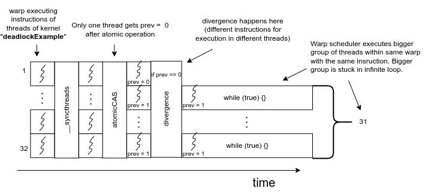

# CUDA-programming-examples-TUM-HPC
## Code examples
### Deadlocks

Deadlock occurs when multiple threads or groups of threads wait indefinitely for each other due to improper use of synchronization primitives like \_\_syncthreads() or improper kernel configurations. Typically, deadlocks arise when threads within a block do not uniformly reach synchronization points.

Most common case is of deadlock is conditional branching which causes some threads to skip a synchronization primitive that others execute. Because synchronization operations require participation from every thread in a block, any divergence leading to threads waiting indefinitely results in stalled computations and severe performance degradation, potentially causing the entire GPU application to hang.

[deadlock_example.cu](deadlock_example.cu) is an example of a code that causes deadlock.

```bash
int atomicCAS(int* addr, int comp, int val);
```

is an atomic CUDA function used to safely perform read-modify-write operations on shared or global memory. The term CAS stands for "Compare-And-Swap," reflecting the operation’s logic:
* The function reads the current value stored at the memory location pointed to by (int* addr).
* It compares this value with the provided compare value (int comp).
* If both values are equal, it replaces the current value at the memory location with the new value (int val).
* The original value at int* addr (before any modification) is returned to the calling thread.

Term "Atomic" here comes from actual atom definition from physics which (in simple terms) is a indivisible particle. This means that the entire compare-and-swap (CAS) operation occurs as one indivisible step. Once an atomic operation starts, no other thread can interrupt or access that memory location or change it until the operation finishes.

Example: In the code:

```bash
atomicCAS(&semaphore, 0, 1)
```

checks if semaphore is 0. If so, it sets semaphore to 1 and returns 0 (old value located by address). Otherwise, it returns 1.

Let's go back to our code snippet of a deadlock, take a look at diagram below displaying timeline of execution of threads within deadlockExample() kernel.



* **Start kernel** When kernel is invoked, blocks assigned to SM, warp scheduler in SM assigns a warp, warp starts executing instructions. Each thread stops at __syncthreads until everyone reaches this instruction.
* **AtomicCAS** Because AtomicCAS is an atomic operation, only one thread gets "prev == 0". From diagram we see that it is a thread 1.
* **if prev == 0 divergence** Condition "if prev == 0" is true only for the first thread and that's where the thread divergence occur. Warp can execute only one instruction at a time. If there are different paths and different instructions, warp executes threads with different instructions sequentially.
* **while (true) {} infinite loop** Warp chooses the majority of threads that will be executed first. In our case it's 31 threads that have "prev == 1" and because of that stuck in a infinite loop "while (true)". This causes deadlock and our code gets stuck forever (or until we manually kill the process).

Preventing deadlocks involves ensuring synchronization primitives are used consistently and all threads within a block execute synchronization instructions identically. 

In our example we can avoid the deadlock, caused by warp scheduler by omitting the break instruction and adding more operations after the if-block (where the divergence occur) that are supposed to be executed by all threads.